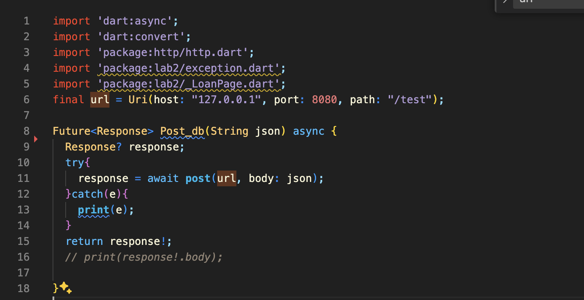

# Database Lab2 Report

> PB21111708 刘睿博

## 项目选题与需求分析

+ 选题：实现一个银行管理系统

+ 需求分析

  + 客户群体：银行管理员/银行员工/客户
  + 客户需求：存款/取款/贷款/修改个人信息/
  + 员工需求：对客户贷款进行管理
  + 管理员需求：对银行/部门/员工进行管理

+ 模式设计

  采用B/S架构，前端使用Flutter/Dart实现网页的构建并封装用户请求，后端使用Java封装数据库并接收/处理前端的请求，前后端通过HTTP通信json格式数据实现

+ 数据库设计

1. **银行信息 (Bank)**
    - `BankID` (主键)
    - `BName`
    - `BAddress`
    - `Bmail`
    - `BTel`
2. **客户信息 (Customer)**
    - `CustomerID` (主键)
    - `CName`
    - `CAddress`
    - `CTel`
    - `Cmail`
3. **账户信息 (Account)**
    - `AccountID` (主键)
    - `AccountType`
    - `Balance`
    - `CustomerID` (外键，引用 Customer)
    - `BankID` (外键，引用 Bank)
4. **贷款信息 (Loan)**
    - `LoanID` (主键)
    - `Amount`
    - `InterestRate`
    - `LoanDate`
    - `Request Date`
    - `Status`
    - `AccountID` (外键，引用 Customer)
    - `Employee ID` (外键，引用 Employee)
    - `BankID` (外键，引用 Bank)
5. **银行部门信息 (Department)**
    - `DepartmentID` (主键)
    - `DName`
    - `BankID` (外键，引用 Bank)
6. **员工信息 (Employee)**
    - `EmployeeID` (主键)
    - `EName`
    - `Email`
    - `Salary`
    - `DepartmentID` (外键，引用 Department)

### 实体关系

- 一个银行有多个客户和多个账户。
- 一个客户可以有多个账户。
- 一个账户可以有多个贷款
- 一个银行有多个部门。
- 一个部门有多个员工。
- 每个贷款和账户都关联到一个特定的银行和客户。

###  ER 图见附件

[DataBase_ER_Graph.pdf](DataBase_ER_Graph.pdf) 

### 前后端通信类型

+ login
+ checkAuthentication
+ register
+ getUserDetail
+ Authenticate
+ getBankList
+ getDepartmentList
+ getLoanList
+ getEDB
+ getInterestRate
+ applyLoan
+ repayLoan
+ cancelLoan
+ confirmLoan
+ denyLoan
+ modifyMail
+ modifyTel
+ registerEmployee
+ uploadAvatar
+ getEmployeeList
+ getEmployeeName
+ getBankListDetail
+ saveMoney
+ withdrawMoney
+ modifyDepartment
+ getAccountName
+ delEmployee
+ getCustomerList

---

## 前端框架

前端使用`Flutter/Dart`语言，我们从main函数开始

### main.dart


main中运行了MyApp 而MyApp使用了MaterialAPP类构建了一个应用，指定了MyHomePage为`home`页


这里展现了home页的基本逻辑，使用page来判断当前显示何页


这里仅展示_buildLoanCheck函数进行演示，它返回了一个Container类，里面封装了一个LoanPage页面，并对Container的外观进行了一些修饰

---

### _LoanPage.dart

```dart
class _LoanPageState extends State<LoanPage> {
  Future<List<Loan>> _loanList = user.getLoanList();

  @override
  Widget build(BuildContext context) {
    return Scaffold(
      appBar: user.isCustomer ? AppBar(
        title: 
        ElevatedButton(
          onPressed: (){
            Navigator.push(
              context,
              MaterialPageRoute(builder: (context) => LoanApplyPage())
            ).then((value){
              setState(() {
                _loanList = user.getLoanList();
              });
            });
          },
          child: Text('贷款'),
        ),
      ): AppBar(
        title: Text('所有贷款'),
      ),
      body: Padding(
        padding: const EdgeInsets.all(16.0),
        child: _buildUserLoanList(),
      ),
    );
  }
  ......
}
```

继续仅演示LoanPage的实现方式

LoanPage也继承自StatefulWidget类，这代表它的状态是可变的，可以通过SetState(){}方法刷新状态

覆写的build方法主要构建了两个Widget：用于贷款的按钮和显示贷款信息的列表

---

### to_server.dart



