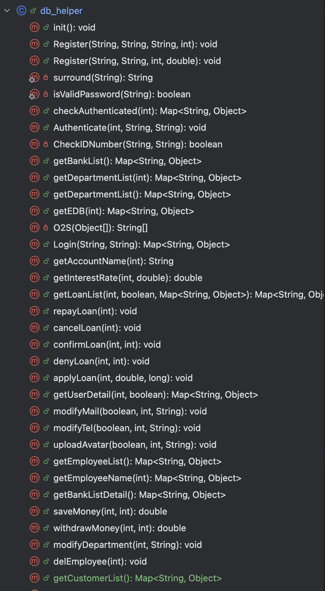
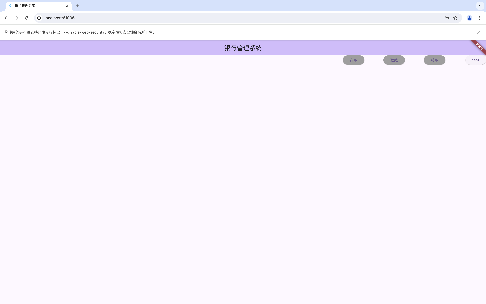
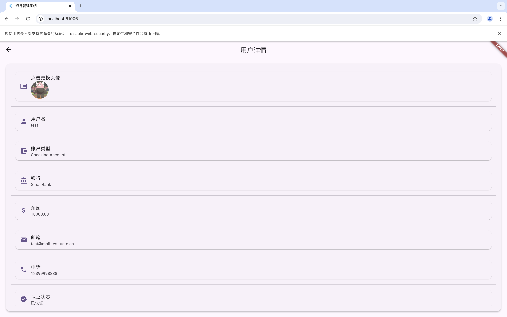
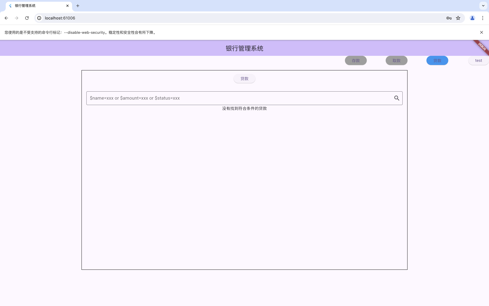

# Database Lab2 Report

> PB21111708 刘睿博

## 项目选题与需求分析

+ 选题：实现一个银行管理系统

+ 需求分析

  + 客户群体：银行管理员/银行员工/客户
  + 客户需求：存款/取款/贷款/修改个人信息/
  + 员工需求：对客户贷款进行管理
  + 管理员需求：对银行/部门/员工进行管理

+ 模式设计

  采用B/S架构，前端使用Flutter/Dart实现网页的构建并封装用户请求，后端使用Java封装数据库并接收/处理前端的请求，前后端通过HTTP通信json格式数据实现

+ 数据库设计

1. **银行信息 (Bank)**
    - `BankID` (主键)
    - `BName`
    - `BAddress`
    - `Bmail`
    - `BTel`
2. **客户信息 (Customer)**
    - `CustomerID` (主键)
    - `CName`
    - `CAddress`
    - `CTel`
    - `Cmail`
3. **账户信息 (Account)**
    - `AccountID` (主键)
    - `AccountType`
    - `Balance`
    - `CustomerID` (外键，引用 Customer)
    - `BankID` (外键，引用 Bank)
4. **贷款信息 (Loan)**
    - `LoanID` (主键)
    - `Amount`
    - `InterestRate`
    - `LoanDate`
    - `Request Date`
    - `Status`
    - `AccountID` (外键，引用 Customer)
    - `Employee ID` (外键，引用 Employee)
    - `BankID` (外键，引用 Bank)
5. **银行部门信息 (Department)**
    - `DepartmentID` (主键)
    - `DName`
    - `BankID` (外键，引用 Bank)
6. **员工信息 (Employee)**
    - `EmployeeID` (主键)
    - `EName`
    - `Email`
    - `Salary`
    - `DepartmentID` (外键，引用 Department)

### 实体关系

- 一个银行有多个客户和多个账户。
- 一个客户可以有多个账户。
- 一个账户可以有多个贷款
- 一个银行有多个部门。
- 一个部门有多个员工。
- 每个贷款和账户都关联到一个特定的银行和客户。

###  ER 图见附件

[DataBase_ER_Graph.pdf](DataBase_ER_Graph.pdf) 

### 前后端通信类型

+ login
+ checkAuthentication
+ register
+ getUserDetail
+ Authenticate
+ getBankList
+ getDepartmentList
+ getLoanList
+ getEDB
+ getInterestRate
+ applyLoan
+ repayLoan
+ cancelLoan
+ confirmLoan
+ denyLoan
+ modifyMail
+ modifyTel
+ registerEmployee
+ uploadAvatar
+ getEmployeeList
+ getEmployeeName
+ getBankListDetail
+ saveMoney
+ withdrawMoney
+ modifyDepartment
+ getAccountName
+ delEmployee
+ getCustomerList

---

## 前端框架

前端使用`Flutter/Dart`语言，我们从main函数开始

### main.dart


main中运行了MyApp 而MyApp使用了MaterialAPP类构建了一个应用，指定了MyHomePage为`home`页


这里展现了home页的基本逻辑，使用page来判断当前显示何页


这里仅展示_buildLoanCheck函数进行演示，它返回了一个Container类，里面封装了一个LoanPage页面，并对Container的外观进行了一些修饰

---

### _LoanPage.dart

```dart
class _LoanPageState extends State<LoanPage> {
  Future<List<Loan>> _loanList = user.getLoanList();

  @override
  Widget build(BuildContext context) {
    return Scaffold(
      appBar: user.isCustomer ? AppBar(
        title: 
        ElevatedButton(
          onPressed: (){
            Navigator.push(
              context,
              MaterialPageRoute(builder: (context) => LoanApplyPage())
            ).then((value){
              setState(() {
                _loanList = user.getLoanList();
              });
            });
          },
          child: Text('贷款'),
        ),
      ): AppBar(
        title: Text('所有贷款'),
      ),
      body: Padding(
        padding: const EdgeInsets.all(16.0),
        child: _buildUserLoanList(),
      ),
    );
  }
  ......
}
```

继续仅演示LoanPage的实现方式

LoanPage也继承自StatefulWidget类，这代表它的状态是可变的，可以通过SetState(){}方法刷新状态

覆写的build方法主要构建了两个Widget：用于贷款的按钮和显示贷款信息的列表

---

### to_server.dart


这个文件封装了对后端的通信过程 通过POST本地的8080端口通信

### User.dart

下面是对几个实体的封装类

```dart
class Loan{
  final int LoanID;
  final double Amount;
  final double InterestRate;
  final String LoanDate;//借款日期
  final String RequestDate;//还款日期
  final int AccountID;
  final String EmployeeName;
  int Status;
  Loan(this.LoanID, this.Amount, this.InterestRate, this.LoanDate, this.RequestDate, this.AccountID, { this.Status = -1, this.EmployeeName = ''});
}

class Bank{
  final int BankID;
  final String BankName;
  String BankAddress;
  String BankTel;
  String BankMail;

  Bank(this.BankID, this.BankName, {this.BankAddress = '', this.BankTel = '', this.BankMail = ''});
}

class User{
  final String name;
  final String password;
  int id;
  int bankID;
  String mail;
  String tel;
  String base64Avatar;

  //下面是用户的信息
  bool isCustomer = true;
  String accountType;
  double balance;
  bool isAuthenticated;
  String customerName;
  List<Loan> loanList = [];

  //下面是管理员的信息
  String departmentName;
  int departmentID;
  double salary;
  

  User({required this.name, required this.password, this.id = -1, this.isAuthenticated = false, 
        this.accountType = '', this.bankID = -1, this.balance = 0.0, this.departmentName = '', 
        this.departmentID = -1, this.salary = 0.0, this.mail = '', this.tel = '', this.customerName = '', this.base64Avatar = '', this.isCustomer  = true});

  factory User.fromJson(Map<String, dynamic> json){
    return User(
      name: json['name'],
      password: json['password']
    );
  }
```

这里使用了Flutter/Dart中的`Factory`关键字，防止构造同一用户类

前端部分手搓了3k行，核心部分已展示完，细节太多其余就不再赘述


---

### 后端部分

后端使用Java来构建服务端

### db_server.java


这个java文件实现了对数据库的封装，并提供了最基础的接口支持：

+ `InsertTable`/`simpleQuery`/`UpdateTable`/`DeleteTable` 实现了对某一个表的增删改查
+ `***Loan***`这一类方法是对数据库中某一存储过程的接口
+ 其余的private方法实现了对数据库的初始化和输入合法性检查

下面以`simpleQuery`方法为例

```java
    /**
     * Query the database SIMPLY
     *
     * @param json a map of the query
     * @table the table to query
     * @columns the columns to return
     * @conditions the conditions to query
     * @return a map of the query result and count as its length
     * @exception DatabaseException if the query failed
     */
    public static Map<String, Object> simpleQuery(Map<String, Object> json){
        var table = (String) json.get("table");
        var ret_columns = (String[]) json.get("columns");
        var conditions = (String[]) json.get("conditions");
        var res = new HashMap<String, Object>();
        try {
            Statement statement = connection.createStatement();
            var sql = "SELECT " + String.join(", ", ret_columns)
                    + " FROM " + table;
            if(conditions != null){
                sql += " WHERE " + String.join(" AND ", conditions);
            }
            ResultSet resultSet = statement.executeQuery(sql);

            int count = 0;
            while (resultSet.next()) {
                count++;
                if (ret_columns.length == 1 && ret_columns[0].equals("*")) {
                    ResultSetMetaData metaData = resultSet.getMetaData();
                    ret_columns = new String[metaData.getColumnCount()];
                    for (int i = 0; i < metaData.getColumnCount(); i++) {
                        ret_columns[i] = metaData.getColumnName(i + 1);
                    }
                }
                for (String column : ret_columns) {
                    var temp = (Object[]) res.get(column);
                    temp = temp == null ? new Object[0] : temp;
                    temp = Arrays.copyOf(temp, temp.length + 1);
                    temp[temp.length - 1] = resultSet.getObject(column);
                    res.put(column, temp);
                }
            }
            res.put("count", count);
            if(count == 0){
                if(ret_columns.length == 1 && ret_columns[0].equals("*")){
                    ResultSetMetaData metaData = resultSet.getMetaData();
                    ret_columns = new String[metaData.getColumnCount()];
                    for (int i = 0; i < metaData.getColumnCount(); i++) {
                        ret_columns[i] = metaData.getColumnName(i + 1);
                    }
                }
                for(String column : ret_columns){
                    res.put(column, new Object[0]);
                }
            }

        } catch (SQLException e) {
            e.printStackTrace();
//            return null;
            throw new DatabaseException(DatabaseExceptionType.UNKNOWN_ERROR, "In Simple Query"+e.getMessage());
        }
        return res;
    }

```

将json解码访问数据库，将数据库返回的信息封装（如果查询不到就把元数据（表头）返回），并将数据库的异常封装后抛出

---

### db_helper.java



这个文件中实现了所有的后端的功能，作为接口提供给Main.java

```java
    /**
     * Login
     * @param AccountName the name of the account
     * @param password the password of the account
     * @return a map contains the detail of the user
     */
    public Map<String, Object> Login(String AccountName, String password){
        var res = db_server.simpleQuery(Map.of("table", "Account", "columns", new String[]{"AccountID"},
                "conditions", new String[]{"AccountName = '" + AccountName + "'"}));
        var count = res.get("count");
        if(count.equals(0)) {
            var Employee_res = db_server.simpleQuery(Map.of("table", "Employee", "columns", new String[]{"EmployeeID"},
                    "conditions", new String[]{"EmployeeName = '" + AccountName + "'"}));
            var Employee_count = Employee_res.get("count");
            if(Employee_count.equals(0))
                throw new DatabaseException(DatabaseExceptionType.ACCOUNT_NOT_FOUND, AccountName);
            int EmployeeID = (int) ((Object[]) Employee_res.get("EmployeeID"))[0];
            Employee_res = db_server.simpleQuery(Map.of("table", "ePassword", "columns", new String[]{"password"},
                    "conditions", new String[]{"EmployeeID = " + EmployeeID}));
            count = Employee_res.get("count");
            if(count.equals(0)) throw new DatabaseException(DatabaseExceptionType.ACCOUNT_NOT_FOUND, AccountName);
            String password_in_db = ((Object[]) Employee_res.get("password"))[0].toString();
            if(!password_in_db.equals(password))
                throw new DatabaseException(DatabaseExceptionType.ACCOUNT_PASSWORD_NOT_MATCH, AccountName);
            var ret = db_server.simpleQuery(Map.of("table", "Employee", "columns", new String[]{"*"},
                    "conditions", new String[]{"EmployeeID = " + EmployeeID}));
            if(ret.get("count").equals(0)) throw new DatabaseException(DatabaseExceptionType.ACCOUNT_NOT_FOUND, AccountName);
            ret.put("isCustomer", false);
            return ret;
        }
        int AccountID = (int) ((Object[]) res.get("AccountID"))[0];
        res = db_server.simpleQuery(Map.of("table", "Password", "columns", new String[]{"password"},
                "conditions", new String[]{"AccountID = " + AccountID}));
        count = res.get("count");
        if(count.equals(0)) throw new DatabaseException(DatabaseExceptionType.ACCOUNT_NOT_FOUND, AccountName);
        String password_in_db = ((Object[]) res.get("password"))[0].toString();
        if(!password_in_db.equals(password))
            throw new DatabaseException(DatabaseExceptionType.ACCOUNT_PASSWORD_NOT_MATCH, AccountName);
        var ret = db_server.simpleQuery(Map.of("table", "Account", "columns", new String[]{"*"},
                "conditions", new String[]{"AccountID = " + AccountID}));
        if(ret.get("count").equals(0)) throw new DatabaseException(DatabaseExceptionType.ACCOUNT_NOT_FOUND, AccountName);
        ret.put("isCustomer", true);
        return ret;
    }
```

这个方法用于用户登录，先检查用户表中是否存在，如果存在则校验密码，如果不存在则查询是否是员工

---

### DatabaseExceptionType.java


这里定义了所有可能出现的异常情况

---

### Main.java

```Java
public class Main {
    static db_helper dbh = new db_helper();
    public static void main(String[] args) {
        int port = 8080; // 监听的端口号
        dbh.init();
        try {
            // 创建 HttpServer 实例并绑定到指定端口
            HttpServer server = HttpServer.create(new InetSocketAddress(port), 0);
            System.out.println("服务器已启动，正在监听端口 " + port);

            // 创建上下文并指定处理器
            server.createContext("/test", new MyHandler());

            // 创建默认的执行器
            server.setExecutor(null);

            // 启动服务器
            server.start();
        } catch (IOException e) {
            System.err.println("服务器启动失败：" + e.getMessage());
        }
    }
  static class MyHandler implements HttpHandler {
        @Override
        public void handle(@NotNull HttpExchange exchange) throws IOException
    ...
  }
}
```

Main创建了一个Http服务器实例并监听8080端口，定义了一个HTTP请求的处理器，并挂在/test下

---

## 仓库地址

后端仓库：[JYJSXX/DB_Server (github.com)](https://github.com/JYJSXX/DB_Server)

前端仓库：[JYJSXX/BankManageSystem (github.com)](https://github.com/JYJSXX/BankManageSystem)

## 实验与测试

### 部署后端

后端部分请使用IntelliJ IDEA打开项目文件夹

之后只需准备好Java22 SDK即可

后端项目使用Maven解决依赖，只需 右键pom.xml--Maven-Reload Project即可

---

### 部署前端

前端部分flutterSDK会根据`pubspec.yaml`文件自动解决依赖

你需要先安装flutter工具链，然后运行以下命令以确保flutter正确安装

```shell
$ flutter --version
```

```shell
jyjs@JHost lab2 % flutter --version
Flutter 3.22.0 • channel stable • https://github.com/flutter/flutter.git
Framework • revision 5dcb86f68f (6 周前) • 2024-05-09 07:39:20 -0500
Engine • revision f6344b75dc
Tools • Dart 3.4.0 • DevTools 2.34.3
```

应该有类似以上输出，证明flutter工具链以成功安装

然后你需要检查相应组件是否齐备，运行

```sh
$ flutter doctor
```

```sh
Doctor summary (to see all details, run flutter doctor -v):
[✓] Flutter (Channel stable, 3.22.0, on macOS 14.5 23F79 darwin-arm64, locale zh-Hans-CN)
[✗] Android toolchain - develop for Android devices
    ✗ Unable to locate Android SDK.
      Install Android Studio from: https://developer.android.com/studio/index.html
      On first launch it will assist you in installing the Android SDK components.
      (or visit https://flutter.dev/docs/get-started/install/macos#android-setup for detailed instructions).
      If the Android SDK has been installed to a custom location, please use
      `flutter config --android-sdk` to update to that location.

[✗] Xcode - develop for iOS and macOS
    ✗ Xcode installation is incomplete; a full installation is necessary for iOS and macOS development.
      Download at: https://developer.apple.com/xcode/
      Or install Xcode via the App Store.
      Once installed, run:
        sudo xcode-select --switch /Applications/Xcode.app/Contents/Developer
        sudo xcodebuild -runFirstLaunch
    ✗ CocoaPods not installed.
        CocoaPods is used to retrieve the iOS and macOS platform side's plugin code that responds to your plugin usage on the
        Dart side.
        Without CocoaPods, plugins will not work on iOS or macOS.
        For more info, see https://flutter.dev/platform-plugins
      To install see https://guides.cocoapods.org/using/getting-started.html#installation for instructions.
[✓] Chrome - develop for the web
[!] Android Studio (not installed)
[✓] IntelliJ IDEA Ultimate Edition (version 2024.1.1)
[✓] VS Code (version 1.90.2)
[✓] Connected device (2 available)
[✓] Network resources
```

会有以上输出(Mac)如果是Windows可能会略有差异，但总体上一致。

请保证`Flutter` `Chrome`控件存在

之后切换到工程目录(含pubspec.yaml)并使用`dart pub get`命令获取依赖

最后，执行`flutter run`并选择运行平台为Chrome即可


当然，你可以通过VSCode自带的调试来运行，更加简单

### Tips

> 你可能需要参照[在中国网络环境下使用 Flutter | Flutter 中文文档 - Flutter 中文开发者网站 - Flutter](https://docs.flutter.cn/community/china)，设置镜像站点
>
> flutter每一次更新SDK版本时均需将chrome库中的安全模式disabel，否则会抛XML异常

---

### 功能展示

> 初始界面


> 注册


> 账户名重复检验


> 强密码检验（8-16位 大小写字母 数字 特殊字符）


> 登录账户


> 用户界面



> 未实名认证不可贷款


> 实名认证


> 身份证检查（只做了位数核验）


> 用户详情界面


> 可以通过点击电话/邮箱/头像更改



> 存款


> 取款


> 一些合法性检验


(视作取0元)

> 贷款


> 取消尚未批款的贷款



> 查询贷款


---

> 下面登录管理员账户


> 用户详情


> 银行管理


> 银行的部门管理(点击银行)


> 更改部门名


> 员工管理


> 添加员工


> 用户列表


> 贷款管理


> 批款和拒绝


> 用户余额同时增加


> 还款(先取出了20w使得余额不足)


成功扣除利息

员工就是仅能管理用户及其贷款的root，这里就不赘述了

使用存储过程和事务编程实现贷款的增删改查

使用触发器实现自动批款

使用函数计算利率

### 关于参考

所有的前后端代码均没有使用现有框架(除Flutter自带的由Google提供的基础组件库)


共4千余行代码

> PS 前端好恶心
